<!-- README.md is generated from README.Rmd. Please edit that file -->
Overview of the package
-----------------------

Basic example
-------------

You can use the `get_county_cd` function to get a vector of all counties within a state:

``` r
get_county_cd(state = c("Georgia", "Alabama"))
#>   [1] "01001" "01003" "01005" "01007" "01009" "01011" "01013" "01015"
#>   [9] "01017" "01019" "01021" "01023" "01025" "01027" "01029" "01031"
#>  [17] "01033" "01035" "01037" "01039" "01041" "01043" "01045" "01047"
#>  [25] "01049" "01051" "01053" "01055" "01057" "01059" "01061" "01063"
#>  [33] "01065" "01067" "01069" "01071" "01073" "01075" "01077" "01079"
#>  [41] "01081" "01083" "01085" "01087" "01089" "01091" "01093" "01095"
#>  [49] "01097" "01099" "01101" "01103" "01105" "01107" "01109" "01111"
#>  [57] "01113" "01115" "01117" "01119" "01121" "01123" "01125" "01127"
#>  [65] "01129" "01131" "01133" "13001" "13003" "13005" "13007" "13009"
#>  [73] "13011" "13013" "13015" "13017" "13019" "13021" "13023" "13025"
#>  [81] "13027" "13029" "13031" "13033" "13035" "13037" "13039" "13043"
#>  [89] "13045" "13047" "13049" "13051" "13053" "13055" "13057" "13059"
#>  [97] "13061" "13063" "13065" "13067" "13069" "13071" "13073" "13075"
#> [105] "13077" "13079" "13081" "13083" "13085" "13087" "13089" "13091"
#> [113] "13093" "13095" "13097" "13099" "13101" "13103" "13105" "13107"
#> [121] "13109" "13111" "13113" "13115" "13117" "13119" "13121" "13123"
#> [129] "13125" "13127" "13129" "13131" "13133" "13135" "13137" "13139"
#> [137] "13141" "13143" "13145" "13147" "13149" "13151" "13153" "13155"
#> [145] "13157" "13159" "13161" "13163" "13165" "13167" "13169" "13171"
#> [153] "13173" "13175" "13177" "13179" "13181" "13183" "13185" "13187"
#> [161] "13189" "13191" "13193" "13195" "13197" "13199" "13201" "13205"
#> [169] "13207" "13209" "13211" "13213" "13215" "13217" "13219" "13221"
#> [177] "13223" "13225" "13227" "13229" "13231" "13233" "13235" "13237"
#> [185] "13239" "13241" "13243" "13245" "13247" "13249" "13251" "13253"
#> [193] "13255" "13257" "13259" "13261" "13263" "13265" "13267" "13269"
#> [201] "13271" "13273" "13275" "13277" "13279" "13281" "13283" "13285"
#> [209] "13287" "13289" "13291" "13293" "13295" "13297" "13299" "13301"
#> [217] "13303" "13305" "13307" "13309" "13311" "13313" "13315" "13317"
#> [225] "13319" "13321"
```

You can use the `get_gages` function to pull all gages within a county or counties. For example, to get information on all gages for Miami-Dade county, you can run:

``` r
library(dplyr)
get_gages("12086", start_date = "1988-01-01", end_date = "2015-01-01") %>%
  slice(1:5)
#>   agency_cd         site_no
#> 1      USGS       022908295
#> 2      USGS 254543080491101
#> 3      USGS 251203080480600
#> 4      USGS 251154080471900
#> 5      USGS        02289019
#>                                          station_nm site_tp_cd dec_lat_va
#> 1 BOTTLE CREEK AT ROOKERY BRANCH NEAR HOMESTEAD, FL         ST   25.46798
#> 2             TAMIAMI CANAL AT S-12-A, NR MIAMI, FL      ST-CA   25.76232
#> 3   WEST LAKE OUTLET TO LONG LAKE NEAR FLAMINGO, FL         ST   25.20072
#> 4            CUTHBERT LAKE OUTLET NEAR FLAMINGO, FL         ST   25.19836
#> 5             TAMIAMI CANAL AT S-12-B  NR MIAMI, FL      ST-CA   25.76183
#>   dec_long_va colocated county_cd
#> 1   -80.85453     FALSE     12086
#> 2   -80.81951     FALSE     12086
#> 3   -80.80161     FALSE     12086
#> 4   -80.78867     FALSE     12086
#> 5   -80.76947     FALSE     12086
```

You can use these two functions together within a pipe chain. For example, to get information on all the gages in Virginia in 2015, you can run:

``` r
va_gages <- get_county_cd("Virginia") %>%
   get_gages(start_date = "2015-01-01", end_date = "2015-12-31")
head(va_gages)
#>   agency_cd  site_no                             station_nm site_tp_cd
#> 1      USGS 02031000      MECHUMS RIVER NEAR WHITE HALL, VA         ST
#> 2      USGS 02032250     MOORMANS RIVER NEAR FREE UNION, VA         ST
#> 3      USGS 02029000         JAMES RIVER AT SCOTTSVILLE, VA         ST
#> 4      USGS 02032640 N F RIVANNA RIVER NEAR EARLYSVILLE, VA         ST
#> 5      USGS 02013000        DUNLAP CREEK NEAR COVINGTON, VA         ST
#> 6      USGS 02014000         POTTS CREEK NEAR COVINGTON, VA         ST
#>   dec_lat_va dec_long_va colocated county_cd
#> 1   38.10264   -78.59279     FALSE     51003
#> 2   38.14069   -78.55585     FALSE     51003
#> 3   37.79737   -78.49140     FALSE     51003
#> 4   38.16347   -78.42473     FALSE     51003
#> 5   37.80290   -80.04700     FALSE     51005
#> 6   37.72901   -80.04228     FALSE     51005
```

The function sends county-by-county requests to the USGS water services server (<https://waterservices.usgs.gov>) and, if there are data for gages within that county, returns that data and adds it to the dataframe returned by the function. This function may result in a message about a 404 HTTP status for some counties. This means that no data was found for one of the counties being queried but will not affect proper running of the function for other counties. Internally, this function uses the `whatNWISsites` function from the package, `dataRetrieval`, but adds the county FIPS code for each gage, allowing users to join gage data with other data identified by county FIPS.

Once you have a list of gage numbers for which you would like to pull flow data, you can use the `get_flow_data` function to pull that data. For example, to pull data for all the stream gage flow data for 1999 for gages in Southhampton County, VA (FIPS code 51175), you can run:

``` r
southampton_gages <- get_gages("51175", start_date = "1999-01-01",
                                end_date = "1999-12-31")
southampton_data <- get_flow_data(southampton_gages, start_date = "1999-01-01",
                                  end_date = "1999-12-31")
```

The output from `get_flow_data` is a data frame with daily streamflow for the queried gages over the requested dates. The data frame has with three columns: "site\_no" = gage number, "date" = date of observation, and "discharge" = mean daily flow in cubic feet per second (USGS parameter code 00060):

``` r
head(southampton_data)
#>    site_no       date discharge
#> 1 02047000 1999-01-01       685
#> 2 02047000 1999-01-02       631
#> 3 02047000 1999-01-03       714
#> 4 02047000 1999-01-04      1300
#> 5 02047000 1999-01-05      2190
#> 6 02047000 1999-01-06      2830
```

``` r
library(ggplot2)
ggplot(southampton_data, aes(x = date, y = discharge, color = site_no)) + 
  geom_line() + theme_classic() + 
  labs(y = "mean daily flow (cubic ft / s)", color = "gage site #")
```

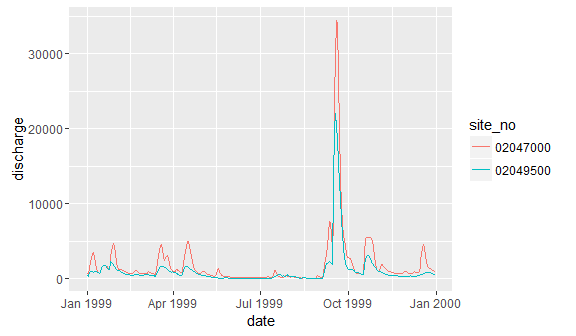

To determine when a flood occurred, we need a value to determine a gage-specific value of streamflow that consitutes a "flood". Expected streamflow values vary substantially from gage to gage, so it is criticial to determine a sensible threshold for each gage included in a study before trying to identify floods at each gage.

One way to get gage-specific flood thresholds is with the `find_nws` function, which gets the National Weather Service flood discharge threshold, when available, for a gage site. Note there are four NWS thresholds for each gage, representing cutoffs for different levels of floods: "Action", "Flood", "Moderate", and "Major". These thresholds are available through the Advanced Hydrologic Prediction Service's "River Stage" information. They are originally in feet for stages, which we convert to streamflow levels using rating tables from the USGS (pulled using the `readNWISrating` function from the `dataRetrieval` package) \[BA: Rod, did I get this right?\].

Gages may have some, all, or none of these NWS flood thresholds available. If a gage does not have any of the four thresholds, it is excluded from the outpout of the `find_nws` function. For example, to get "Moderate" flood thresholds for the Virginia gages, you can run:

``` r
va_nws <- find_nws(site_no = va_gages$site_no, type = "moderate")
head(va_nws)
#>    site_no flood_val
#> 1 01652500  8400.246
#> 2 03168000 55378.500
#> 3 02060500 28306.221
#> 4 01654000  3370.084
#> 5 03173000 17958.120
#> 6 02011400  8008.627
summary(va_nws$flood_val)
#>    Min. 1st Qu.  Median    Mean 3rd Qu.    Max. 
#>    1719    8062   14040   22290   28310   90490
```

Many USGS gages do not have NWS flood thresholds for any of the four categories of floods. For example, out of the 173 gages pulled for Virginia for `va_gages`, only 101 have one or more NWS flood thresholds. Therefore, use of the NWS flood thresholds to identify floods may severely limit the sample size of the data output.

Another way to get gage-specific flood thresholds is with the `find_q2` function, which calculates the median annual flood for each gage using a minimum of 20 years of USGS annual peak flow data:

``` r
va_q2 <- find_q2(site_no = va_gages$site_no)
head(va_q2)
#> # A tibble: 6 × 3
#>    site_no flood_val years
#>      <chr>     <dbl> <int>
#> 1 01613900     923.0    56
#> 2 01615000    2355.0    68
#> 3 01620500     691.5    70
#> 4 01621050     543.0    23
#> 5 01622000    7440.0    87
#> 6 01625000    5740.0    89
summary(va_q2$flood_val)
#>    Min. 1st Qu.  Median    Mean 3rd Qu.    Max. 
#>     112    2606    4970    9447    9477   70770
```

For the Q2 flood threshold, 146 of the gages in Virginia have flood threshold values.

You can compare the results from these two methods for sites where you can get both values (note that both axes are shown on a log-10 scale):

``` r
va_flood_stage <- va_nws %>%
  rename(flood_nws = flood_val) %>%
  inner_join(va_q2, by = "site_no") %>%
  rename(flood_q2 = flood_val)
ggplot(va_flood_stage, aes(x = flood_q2, y = flood_nws)) + 
  geom_point(alpha = 0.5) + 
  geom_abline(aes(intercept = 0, slope = 1), linetype = 3) + 
  geom_smooth(method = "lm", se = FALSE) + 
  scale_x_log10(labels = scales::comma) + scale_y_log10(labels = scales::comma) + 
  labs(x = "Streamflow threshold for\nflood based on USGS Q2",
       y = "Streamflow threshold for flood based\non NWS flood height thresholds") + 
  theme_classic() + 
  expand_limits(x = c(min(va_flood_stage$flood_q2, va_flood_stage$flood_nws),
                      max(va_flood_stage$flood_q2, va_flood_stage$flood_nws)),
                y = c(min(va_flood_stage$flood_q2, va_flood_stage$flood_nws),
                      max(va_flood_stage$flood_q2, va_flood_stage$flood_nws)))
```

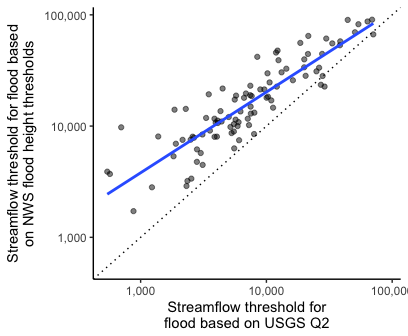

For the Virginia monitors, you can see that the flood values from the "moderate" NWS flood heights and the Q2 method are well-correlated, although NWS values tend to be consistently higher than Q2 values.

Whichever flood threshold you pick, it can be joined to the time series streamflow data obtained with the `get_flow_data` function, and flood status can be determined on each day based on whether streamflow that day exceeded the threshold. For example, the following code can be used to add a binary `flood` variable to the streamflow data pulled earlier for Southampton County, VA:

``` r
southampton_q2 <- find_q2(site_no = southampton_gages$site_no)
southampton_data <- southampton_data %>% 
  left_join(southampton_q2, by = "site_no") %>% 
  select(-years) %>% 
  mutate(flood = discharge >= flood_val)
head(southampton_data)
#>    site_no       date discharge flood_val flood
#> 1 02047000 1999-01-01       685      7980 FALSE
#> 2 02047000 1999-01-02       631      7980 FALSE
#> 3 02047000 1999-01-03       714      7980 FALSE
#> 4 02047000 1999-01-04      1300      7980 FALSE
#> 5 02047000 1999-01-05      2190      7980 FALSE
#> 6 02047000 1999-01-06      2830      7980 FALSE
```

Here are the time series for the two streamgages in the county, with horizontal lines added for the flood threshold used for each gage:

``` r
library(ggplot2)
ggplot(southampton_data, aes(x = date, y = discharge)) + 
  geom_line() + theme_classic() + 
  geom_point(aes(color = flood), alpha = 0.5, size = 1.2) + 
  facet_wrap(~ site_no, ncol = 1) +
  geom_hline(data = southampton_q2, aes(yintercept = flood_val),
             linetype = 3) +
  labs(y = "mean daily flow (cubic ft / s)", color = "Flood status")
```

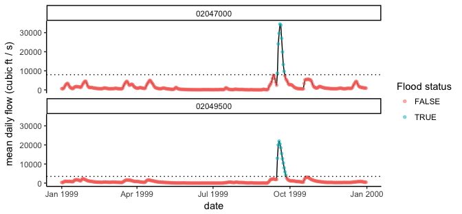

Once you have data on gages, flood values, and flow data, you can also get flood summaries by site using the `flood_analysis` function. For example, to get flood summary statistics by gage for the Virginia gages, you can run:

``` r
va_counties <- get_county_cd("Virginia")
va_flow_data <- get_flow_data(va_gages, start_date = "2015-01-01",
                              end_date = "2015-12-31")
va_floods <- flood_analysis(flow_data = va_flow_data, peaks = va_q2, 
                            gages = va_gages, county_cd = va_counties,
                            threshold = "Q2")
head(va_floods, 3)
#> # A tibble: 3 × 12
#>    site_no county_cd      lat      long   avg_peak flood_dur max_peak
#>      <chr>     <chr>    <dbl>     <dbl>      <dbl>     <int>    <dbl>
#> 1 02072000     51067 36.78069 -80.02476 0.26734310         8 3.953871
#> 2 02040000     51007 37.42154 -77.85889 0.12193978         5 1.880193
#> 3 03524500     51195 36.92927 -82.45626 0.06564404         2 1.876866
#> # ... with 5 more variables: num_missing <int>, size <dbl>, state <chr>,
#> #   county <chr>, flood <fctr>
```

``` r
ggplot(va_floods, aes(x = max_peak, fill = flood)) + 
  geom_histogram()
#> Warning: Removed 31 rows containing non-finite values (stat_bin).
```

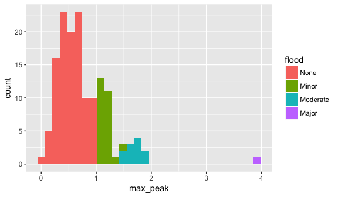

There is also a function that will allow you to get county-level aggregate statistics from this gage-level summary. Any counties with no gages or for which the gages didn't have flow data or flood threshold values are also included:

``` r
va_county_stats <- county_aggregates(flood_stats = va_floods)
head(va_county_stats)
#> # A tibble: 6 × 12
#>   county_cd        county    state num_gage  max_peak  avg_peak minor
#>       <chr>         <chr>    <chr>    <int>     <dbl>     <dbl> <dbl>
#> 1     51001 accomack:main virginia        2        NA        NA    -1
#> 2     51003     albemarle virginia        4 0.5557300 0.5557300     0
#> 3     51005     alleghany virginia        4 0.8574018 0.8574018     0
#> 4     51007        amelia virginia        2 1.8801932 1.8801932   100
#> 5     51009       amherst virginia        1        NA        NA    -1
#> 6     51011    appomattox virginia        1 0.3571429 0.3571429     0
#> # ... with 5 more variables: moderate <dbl>, major <dbl>, extreme <dbl>,
#> #   max_dur <int>, avg_dur <dbl>
```

You can use the `run_flood` function to put all of this together, and pull all flood summaries by either gage (`output = "gage"`), county (`output = "county"`), or both (`output = "both"`) for either a set of counties or all counties in a state. It is more efficient to set (`output = "both"`) and then extract gage or county level data from the list than running each separately since pulling flow data is time consuming.

For example, to get all the flood statistics by gage for all gages with available data in Virginia, you can run:

``` r
va_floods <- run_flood(state = "Virginia", start_date = "2015-01-01",
                       end_date = "2015-12-31", threshold = "Q2",
                       output = "gage")
head(va_floods)
#> # A tibble: 6 × 12
#>    site_no county_cd      lat      long   avg_peak flood_dur max_peak
#>      <chr>     <chr>    <dbl>     <dbl>      <dbl>     <int>    <dbl>
#> 1 02072000     51067 36.78069 -80.02476 0.26734310         8 3.953871
#> 2 02040000     51007 37.42154 -77.85889 0.12193978         5 1.880193
#> 3 03524500     51195 36.92927 -82.45626 0.06564404         2 1.876866
#> 4 03527000     51169 36.64871 -82.75044 0.09350164         2 1.810000
#> 5 02071530     51141 36.77847 -80.24922 0.06066823         1 1.788618
#> 6 02069700     51141 36.57097 -80.12949 0.06709977         1 1.749420
#> # ... with 5 more variables: num_missing <int>, size <dbl>, state <chr>,
#> #   county <chr>, flood <fctr>
```

Similarly, to get county-level data for counties in Florida in 2004, you can run:

``` r
fl_floods <- run_flood(state = "Florida", start_date = "2004-01-01",
                       end_date = "2004-12-31", threshold = "Q2",
                       output = "county")
head(fl_floods)
#> # A tibble: 6 × 12
#>   county_cd   county   state num_gage  max_peak  avg_peak minor moderate
#>       <chr>    <chr>   <chr>    <int>     <dbl>     <dbl> <dbl>    <dbl>
#> 1     12001  alachua florida        1 2.0661376 2.0661376 100.0      100
#> 2     12003    baker florida        2 3.4654378 3.4654378 100.0      100
#> 3     12005      bay florida        1 0.9708029 0.9708029   0.0        0
#> 4     12007 bradford florida        1        NA        NA  -1.0       -1
#> 5     12009  brevard florida        8 4.7323944 4.7323944  87.5       75
#> 6     12011  broward florida        1        NA        NA  -1.0       -1
#> # ... with 4 more variables: major <dbl>, extreme <dbl>, max_dur <int>,
#> #   avg_dur <dbl>
```

These output can be mapped using the `map_flood` function. If the data was collected by gage, this will show a point map with the flood level at each gage. The size of the point corresponds to the size of the stream, based on the median flood value (Q2):

``` r
map_flood(va_floods) 
#> Warning: Removed 31 rows containing missing values (geom_point).
```

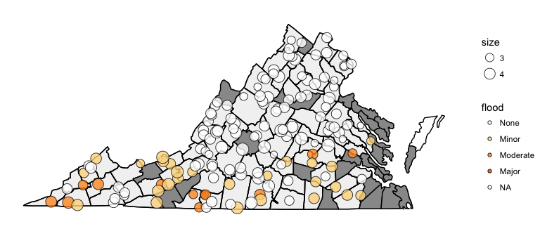

For county-level data, this will create a choropleth indicating the percent of monitors in each county with flood magnitude above a user-specified flood category:

``` r
map_flood(fl_floods)
```

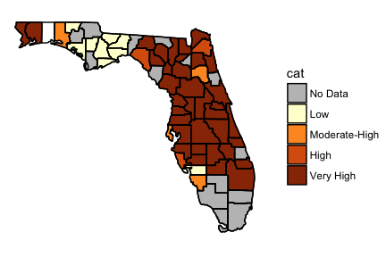

``` r
map_flood(fl_floods, category = "major")
```

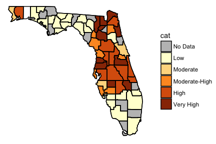

The `long_term_flood` function is very similar to the `run_flood` function except it accepts a data frame as input with three columns: `county_cd`, `start_date`, and `end_date`. This allows you to analyze floods across multiple date ranges and multiple counties. For example, if we wanted to examine April flooding in three counties in northern Virginia we would create the following input data frame:

``` r
county_cd <- c(rep("51013", 5), rep("51107", 5), rep("51059", 5))
start_date <- rep(c("2010-04-01", "2011-04-01", "2012-04-01", "2013-04-01", "2014-04-01"), 3)
end_date <- rep(c("2010-04-30", "2011-04-30", "2012-04-30", "2013-04-30", "2014-04-30"), 3)
input_df <- data.frame(county_cd = county_cd, start_date = start_date, end_date = end_date, stringsAsFactors = FALSE)
head(input_df)
#>   county_cd start_date   end_date
#> 1     51013 2010-04-01 2010-04-30
#> 2     51013 2011-04-01 2011-04-30
#> 3     51013 2012-04-01 2012-04-30
#> 4     51013 2013-04-01 2013-04-30
#> 5     51013 2014-04-01 2014-04-30
#> 6     51107 2010-04-01 2010-04-30
```

It is important that these variables are character strings and not factors. The flood analysis can then be performed:

``` r
#With default values
va_floods <- long_term_flood(input_df)
va_gage_output <- va_floods[[1]]
head(va_gage_output)
#>   start_date   end_date  site_no county_cd      lat      long    avg_peak
#> 1 2010-04-01 2010-04-30 01652500     51013 38.84333 -77.08586 0.005913978
#> 2 2011-04-01 2011-04-30 01652500     51013 38.84333 -77.08586 0.006862366
#> 3 2012-04-01 2012-04-30 01652500     51013 38.84333 -77.08586 0.004701075
#> 4 2013-04-01 2013-04-30 01652500     51013 38.84333 -77.08586 0.004623656
#> 5 2014-04-01 2014-04-30 01652500     51013 38.84333 -77.08586 0.020473118
#> 6 2010-04-01 2010-04-30 01646000     51059 38.97594 -77.24581 0.031423358
#>   flood_dur   max_peak num_missing     size    state    county flood
#> 1         0 0.02193548           0 3.491362 virginia arlington  None
#> 2         0 0.04096774           0 3.491362 virginia arlington  None
#> 3         0 0.06225806           0 3.491362 virginia arlington  None
#> 4         0 0.02903226           0 3.491362 virginia arlington  None
#> 5         0 0.23419355           0 3.491362 virginia arlington  None
#> 6         0 0.07116788           0 3.261659 virginia   fairfax  None
va_county_output <- va_floods[[2]]
head(va_county_output)
#> Source: local data frame [6 x 14]
#> Groups: county_cd, start_date [6]
#> 
#>   county_cd start_date   end_date    county    state num_gage   max_peak
#>       <chr>      <chr>      <chr>     <chr>    <chr>    <int>      <dbl>
#> 1     51013 2010-04-01 2010-04-30 arlington virginia        1 0.02193548
#> 2     51013 2011-04-01 2011-04-30 arlington virginia        1 0.04096774
#> 3     51013 2012-04-01 2012-04-30 arlington virginia        1 0.06225806
#> 4     51013 2013-04-01 2013-04-30 arlington virginia        1 0.02903226
#> 5     51013 2014-04-01 2014-04-30 arlington virginia        1 0.23419355
#> 6     51059 2010-04-01 2010-04-30   fairfax virginia        2 0.07116788
#> # ... with 7 more variables: avg_peak <dbl>, minor <dbl>, moderate <dbl>,
#> #   major <dbl>, extreme <dbl>, max_dur <int>, avg_dur <dbl>
```

If you are interested in seeing when flooding occurred over a set time period, you can perform a time series analysis using the `time_series_flood` function. This has similar inputs to the `run_flood` function. For example, if you wanted to examine when flooding occurred in Virginia from 2010 to 2015:

``` r
va_time_series <- time_series_flood(state = "Virginia", start_date = "2010-01-01",
                      end_date = "2015-12-31", threshold = "NWS",
                      flood_type = "flood")
va_gage_output <- va_time_series[[1]]
head(va_gage_output)
#>    site_no       date discharge      lat      long county_cd     size
#> 1 02029000 2010-01-26     83100 37.79737 -78.49140     51003 4.804139
#> 2 02013000 2013-05-07      8090 37.80290 -80.04700     51005 3.741677
#> 3 02016000 2010-01-25     12000 37.79180 -79.75949     51005 4.053078
#> 4 02016000 2010-01-26      9200 37.79180 -79.75949     51005 4.053078
#> 5 02016000 2011-03-07      8210 37.79180 -79.75949     51005 4.053078
#> 6 02016000 2011-03-11      8110 37.79180 -79.75949     51005 4.053078
#>   flood_ratio    state    county flood
#> 1    1.204161 virginia albemarle Flood
#> 2    1.369648 virginia alleghany Flood
#> 3    1.499788 virginia alleghany Flood
#> 4    1.149837 virginia alleghany Flood
#> 5    1.026105 virginia alleghany Flood
#> 6    1.013607 virginia alleghany Flood
va_county_output <- va_time_series[[2]]
head(va_county_output)
#> # A tibble: 6 × 8
#>         date    county    state num_gage max_peak avg_peak no_flood
#>       <date>     <chr>    <chr>    <int>    <dbl>    <dbl>    <dbl>
#> 1 2010-01-26 albemarle virginia       13 2.175769 1.356310        0
#> 2 2010-01-25 alleghany virginia       14 1.914846 1.273798        0
#> 3 2011-03-07 alleghany virginia        1 1.026105 1.026105        0
#> 4 2011-03-11 alleghany virginia        2 1.044795 1.029201        0
#> 5 2011-04-13 alleghany virginia        1 1.128590 1.128590        0
#> 6 2011-04-17 alleghany virginia        9 1.449845 1.166947        0
#> # ... with 1 more variables: yes_flood <dbl>
```

The county-level output can be plotted using the `time_series_plot` function which shows bar charts of the timing and magnitude of floods during the selected time period. You can select values for `start_date` and `end_date` to change the x-limits on the plots or the default is to show the full time period including any flood.

``` r
time_series_plot(va_county_output)
```

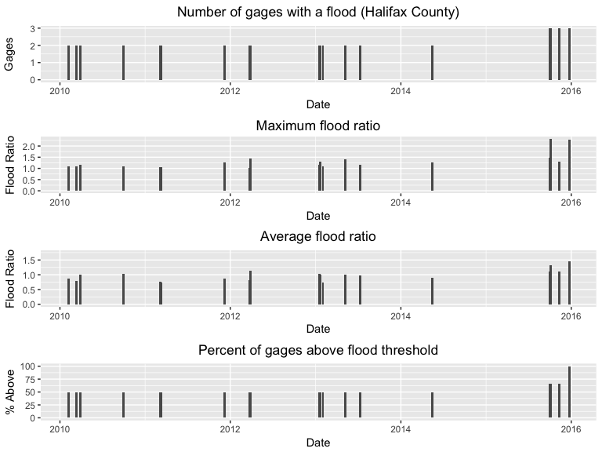

    #> Warning: position_stack requires non-overlapping x intervals

    #> Warning: position_stack requires non-overlapping x intervals

    #> Warning: position_stack requires non-overlapping x intervals

    #> Warning: position_stack requires non-overlapping x intervals


    #> Warning: position_stack requires non-overlapping x intervals

    #> Warning: position_stack requires non-overlapping x intervals

    #> Warning: position_stack requires non-overlapping x intervals

    #> Warning: position_stack requires non-overlapping x intervals

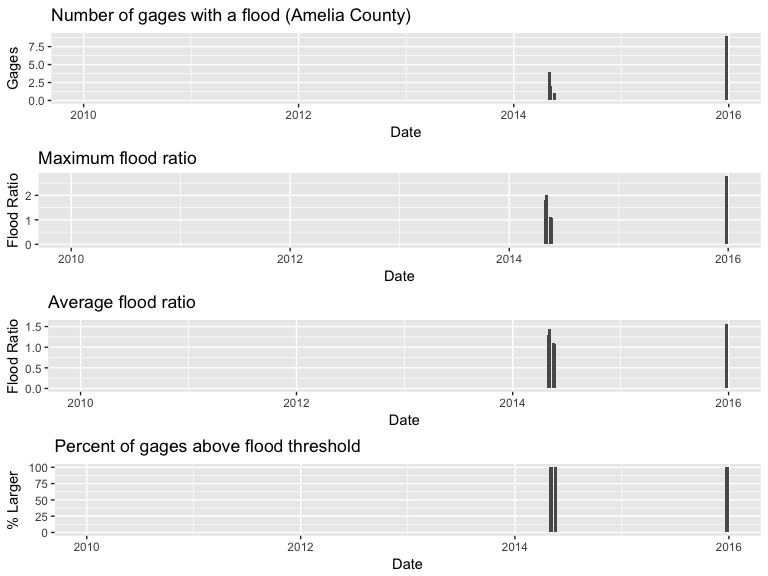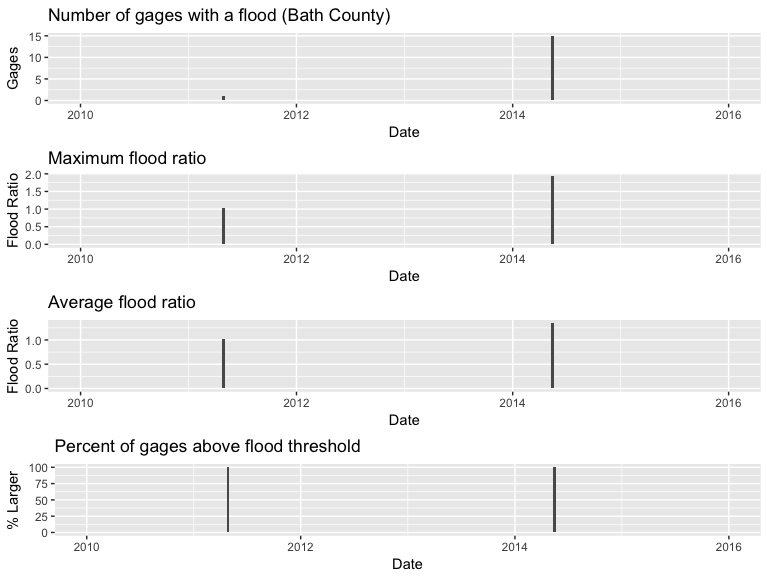

    #> Warning: position_stack requires non-overlapping x intervals

    #> Warning: position_stack requires non-overlapping x intervals

    #> Warning: position_stack requires non-overlapping x intervals

    #> Warning: position_stack requires non-overlapping x intervals

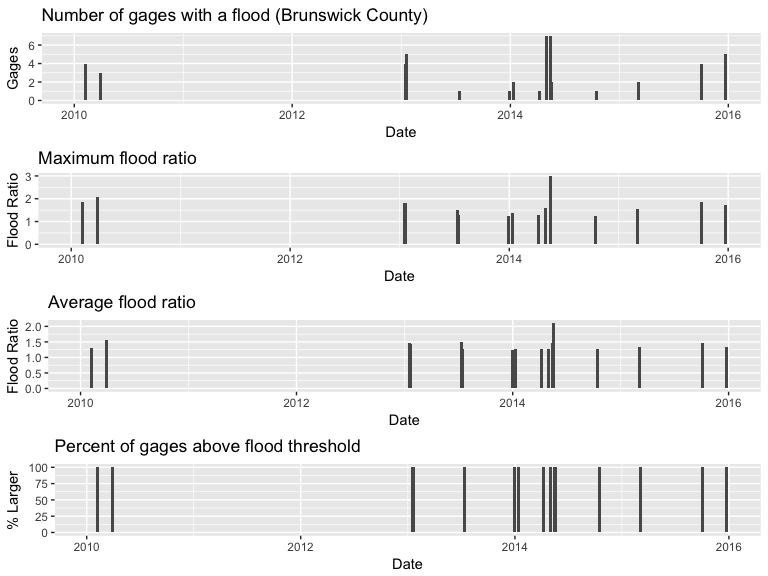

    #> Warning: position_stack requires non-overlapping x intervals

    #> Warning: position_stack requires non-overlapping x intervals

    #> Warning: position_stack requires non-overlapping x intervals

    #> Warning: position_stack requires non-overlapping x intervals

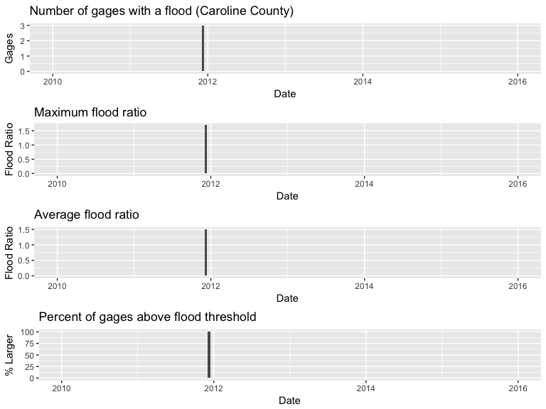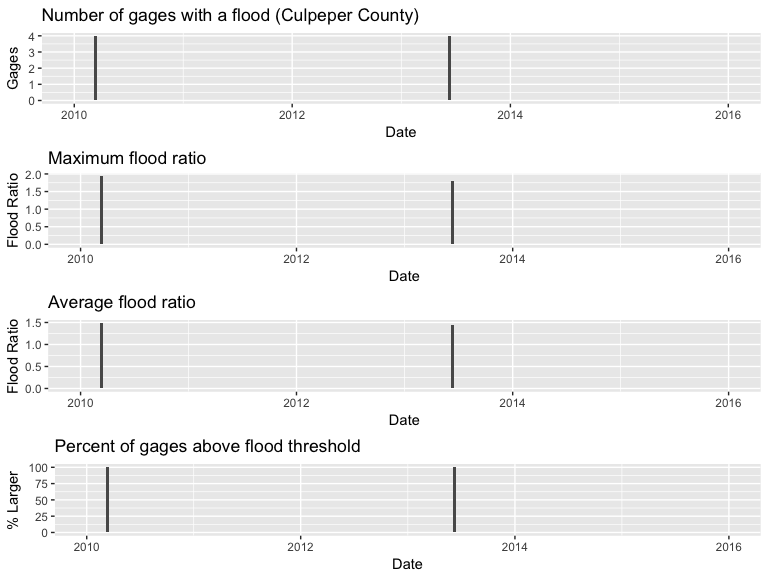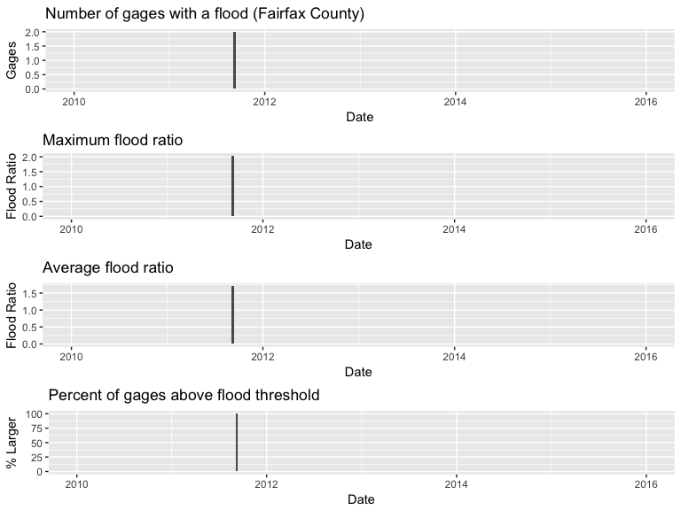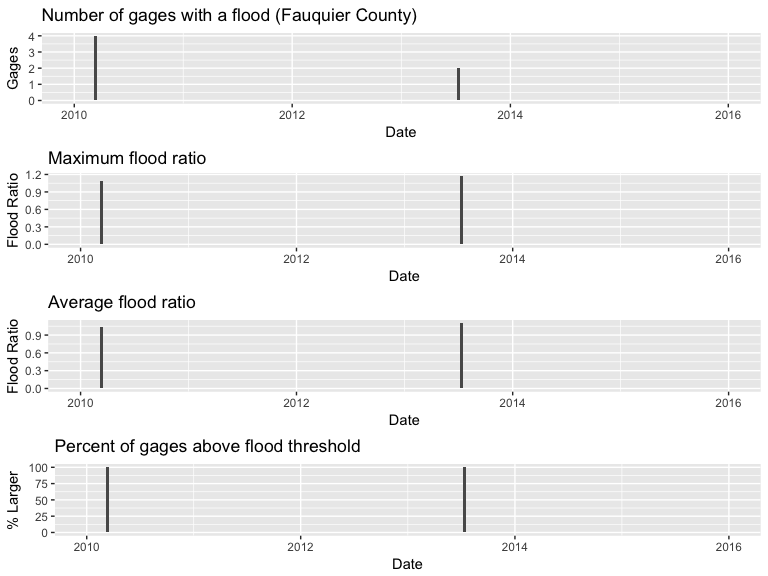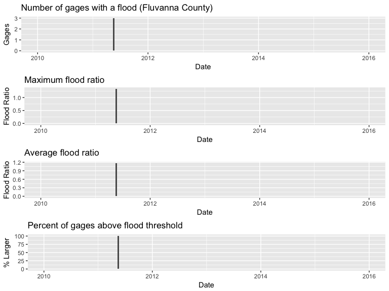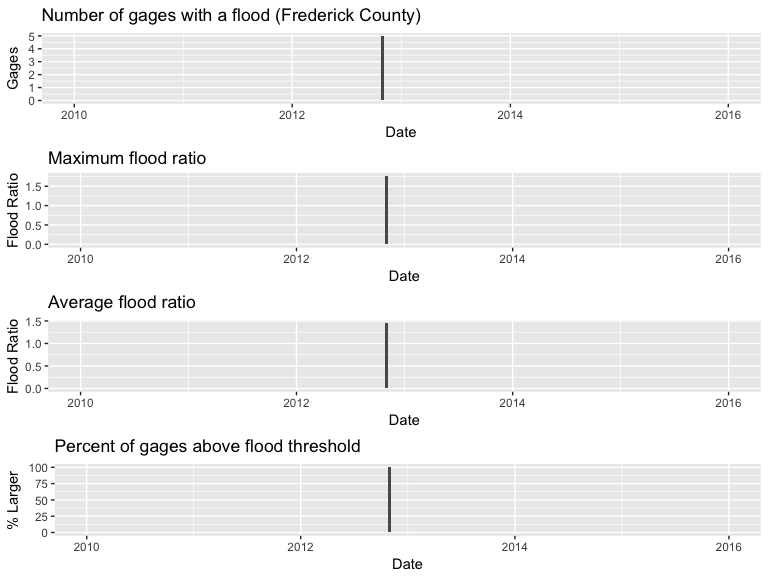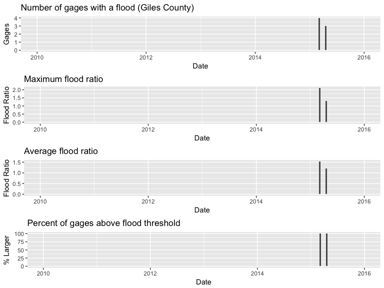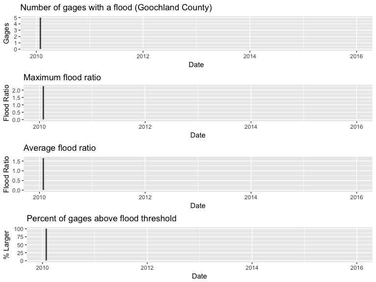

    #> Warning: position_stack requires non-overlapping x intervals

    #> Warning: position_stack requires non-overlapping x intervals

    #> Warning: position_stack requires non-overlapping x intervals

    #> Warning: position_stack requires non-overlapping x intervals

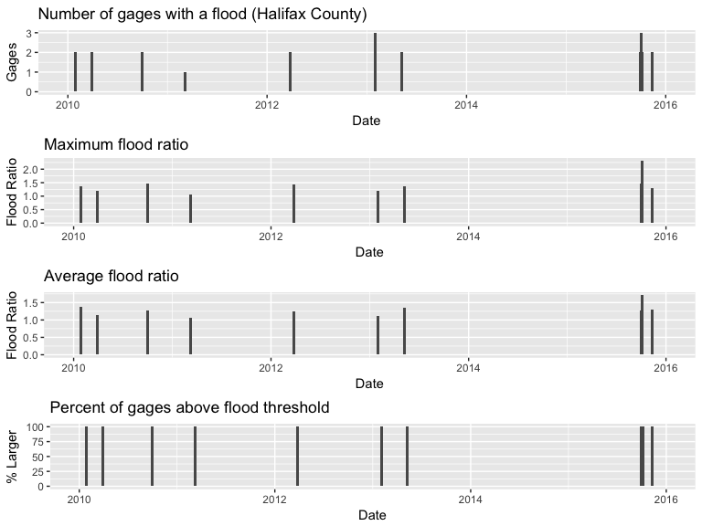

    #> Warning: position_stack requires non-overlapping x intervals

    #> Warning: position_stack requires non-overlapping x intervals

    #> Warning: position_stack requires non-overlapping x intervals

    #> Warning: position_stack requires non-overlapping x intervals

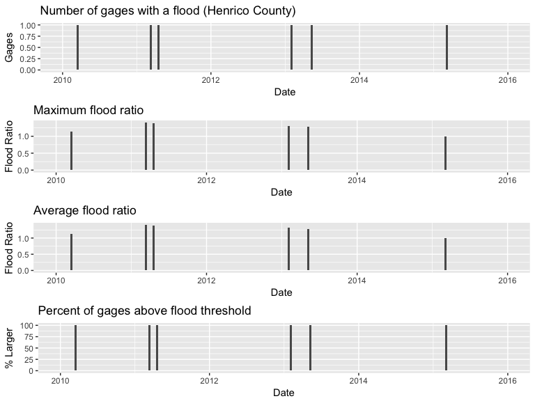

    #> Warning: position_stack requires non-overlapping x intervals

    #> Warning: position_stack requires non-overlapping x intervals

    #> Warning: position_stack requires non-overlapping x intervals

    #> Warning: position_stack requires non-overlapping x intervals

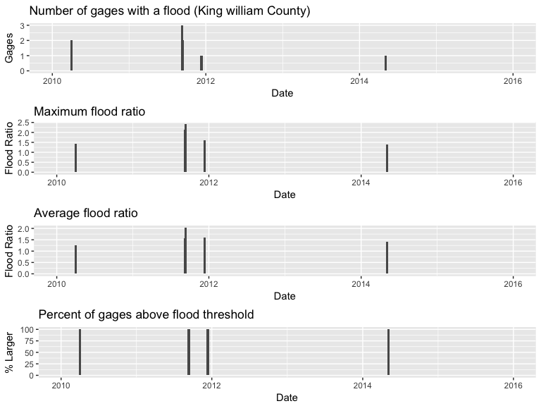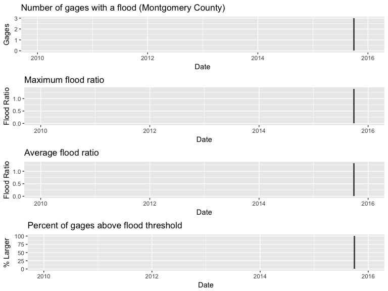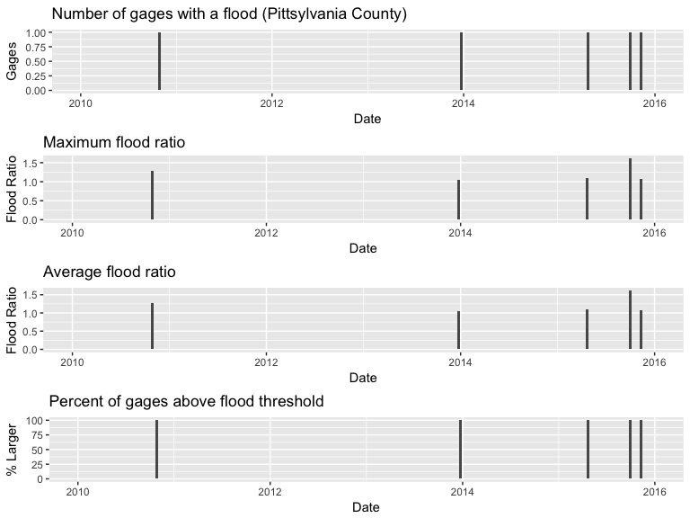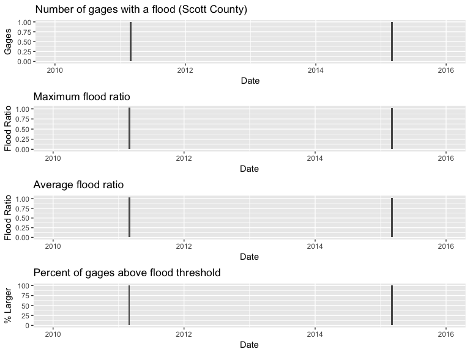

    #> Warning: position_stack requires non-overlapping x intervals

    #> Warning: position_stack requires non-overlapping x intervals

    #> Warning: position_stack requires non-overlapping x intervals

    #> Warning: position_stack requires non-overlapping x intervals

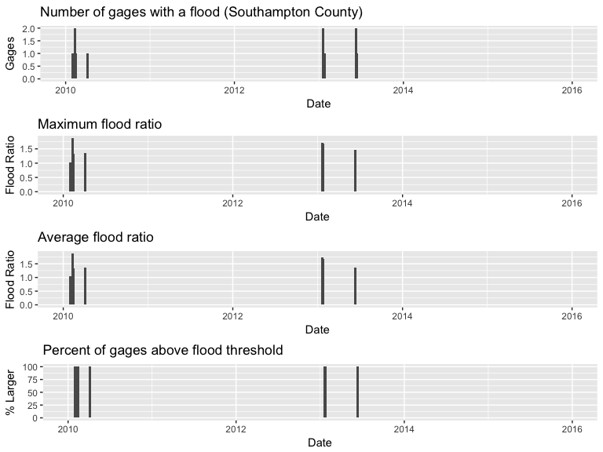

    #> Warning: position_stack requires non-overlapping x intervals

    #> Warning: position_stack requires non-overlapping x intervals

    #> Warning: position_stack requires non-overlapping x intervals

    #> Warning: position_stack requires non-overlapping x intervals

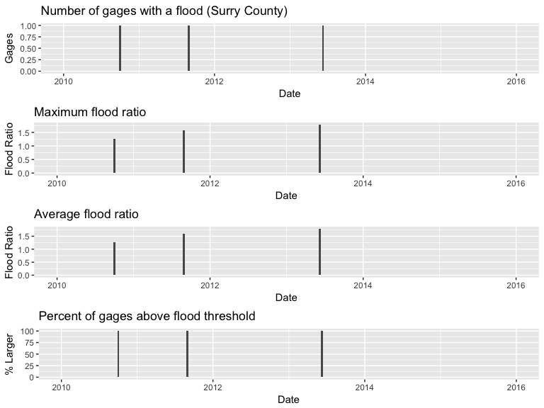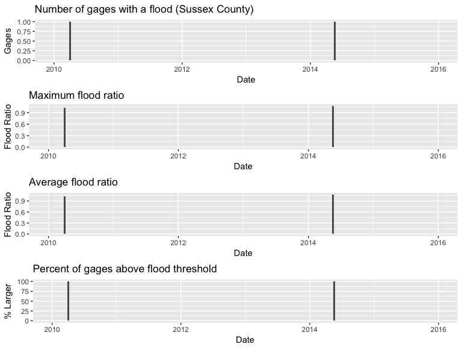

More detailed examples
----------------------

Hurricane Floyd made landfall on Sept. 16, 1999, in North Carolina and caused extensive flooding, especially in eastern North Carolina. Here are maps for the month from Sept.15, 1999 to Oct. 15, 1999:

``` r
nc_floods <- run_flood(state = "North Carolina", start_date = "1999-09-15",
                       end_date = "1999-10-15", threshold = "Q2",
                       output = "both")
nc_maps <- map_flood(nc_floods)
nc_maps[[1]]
#> Warning: Removed 32 rows containing missing values (geom_point).
```

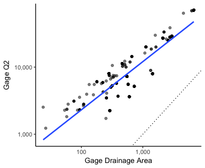

``` r
nc_maps[[2]]
```


You can use the `map_tracks` function from `hurricaneexposure` (currently available in a development version on GitHub), using the flood maps as the base `plot_object` in this call. For example:

``` r
library(hurricaneexposure)
map_tracks(storms = "Floyd-1999", plot_object = nc_maps[[2]])
```

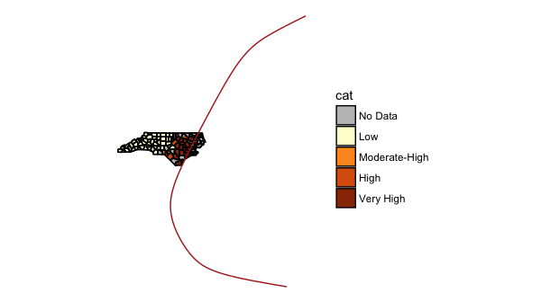

``` r
map_tracks(storms = c("Bonnie-2004", "Charley-2004", 
                      "Frances-2004", "Jeanne-2004"), 
           plot_object = map_flood(fl_floods, category = "major"),
           color = "aquamarine3")
```

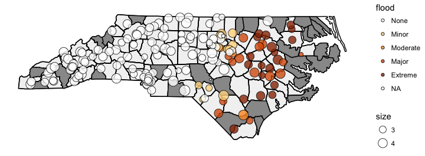
