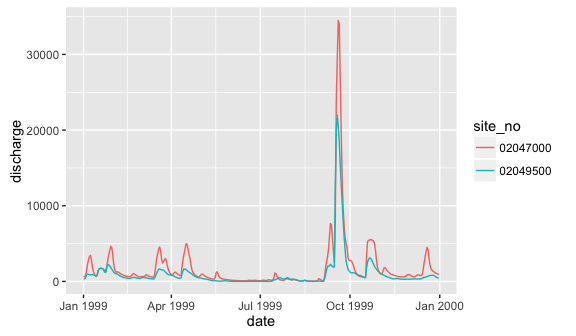
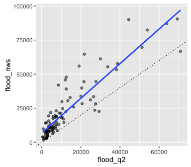
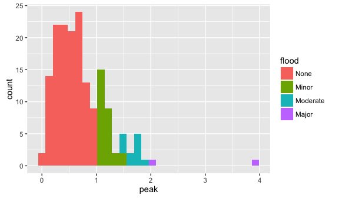
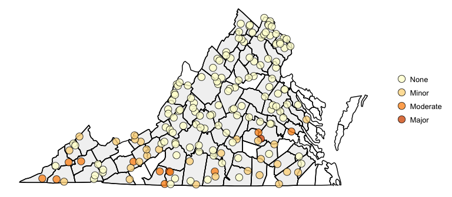
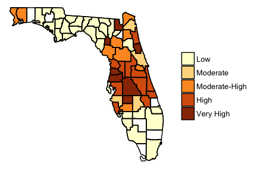
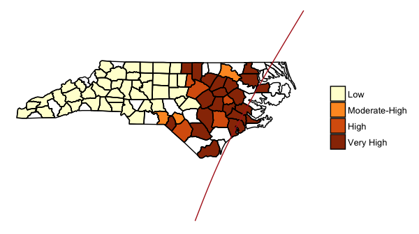
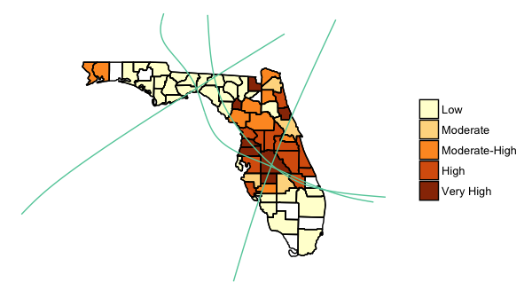

<!-- README.md is generated from README.Rmd. Please edit that file -->
Overview of the package
-----------------------

Basic example
-------------

You can use the `get_county_cd` function to get a vector of all counties within a state:

``` r
get_county_cd(state = c("Georgia", "Alabama"))
#>   [1] "01001" "01003" "01005" "01007" "01009" "01011" "01013" "01015"
#>   [9] "01017" "01019" "01021" "01023" "01025" "01027" "01029" "01031"
#>  [17] "01033" "01035" "01037" "01039" "01041" "01043" "01045" "01047"
#>  [25] "01049" "01051" "01053" "01055" "01057" "01059" "01061" "01063"
#>  [33] "01065" "01067" "01069" "01071" "01073" "01075" "01077" "01079"
#>  [41] "01081" "01083" "01085" "01087" "01089" "01091" "01093" "01095"
#>  [49] "01097" "01099" "01101" "01103" "01105" "01107" "01109" "01111"
#>  [57] "01113" "01115" "01117" "01119" "01121" "01123" "01125" "01127"
#>  [65] "01129" "01131" "01133" "13001" "13003" "13005" "13007" "13009"
#>  [73] "13011" "13013" "13015" "13017" "13019" "13021" "13023" "13025"
#>  [81] "13027" "13029" "13031" "13033" "13035" "13037" "13039" "13043"
#>  [89] "13045" "13047" "13049" "13051" "13053" "13055" "13057" "13059"
#>  [97] "13061" "13063" "13065" "13067" "13069" "13071" "13073" "13075"
#> [105] "13077" "13079" "13081" "13083" "13085" "13087" "13089" "13091"
#> [113] "13093" "13095" "13097" "13099" "13101" "13103" "13105" "13107"
#> [121] "13109" "13111" "13113" "13115" "13117" "13119" "13121" "13123"
#> [129] "13125" "13127" "13129" "13131" "13133" "13135" "13137" "13139"
#> [137] "13141" "13143" "13145" "13147" "13149" "13151" "13153" "13155"
#> [145] "13157" "13159" "13161" "13163" "13165" "13167" "13169" "13171"
#> [153] "13173" "13175" "13177" "13179" "13181" "13183" "13185" "13187"
#> [161] "13189" "13191" "13193" "13195" "13197" "13199" "13201" "13205"
#> [169] "13207" "13209" "13211" "13213" "13215" "13217" "13219" "13221"
#> [177] "13223" "13225" "13227" "13229" "13231" "13233" "13235" "13237"
#> [185] "13239" "13241" "13243" "13245" "13247" "13249" "13251" "13253"
#> [193] "13255" "13257" "13259" "13261" "13263" "13265" "13267" "13269"
#> [201] "13271" "13273" "13275" "13277" "13279" "13281" "13283" "13285"
#> [209] "13287" "13289" "13291" "13293" "13295" "13297" "13299" "13301"
#> [217] "13303" "13305" "13307" "13309" "13311" "13313" "13315" "13317"
#> [225] "13319" "13321"
```

You can use the `get_gages` function to pull all gages within a county or counties. For example, to get information on all gages for Miami-Dade county, you can run:

``` r
library(dplyr)
get_gages("12086", start_date = "1988-01-01", end_date = "2015-01-01") %>%
  slice(1:5)
#>   agency_cd         site_no
#> 1      USGS       022908295
#> 2      USGS 254543080491101
#> 3      USGS 251203080480600
#> 4      USGS 251154080471900
#> 5      USGS        02289019
#>                                          station_nm site_tp_cd dec_lat_va
#> 1 BOTTLE CREEK AT ROOKERY BRANCH NEAR HOMESTEAD, FL         ST   25.46798
#> 2             TAMIAMI CANAL AT S-12-A, NR MIAMI, FL      ST-CA   25.76232
#> 3   WEST LAKE OUTLET TO LONG LAKE NEAR FLAMINGO, FL         ST   25.20072
#> 4            CUTHBERT LAKE OUTLET NEAR FLAMINGO, FL         ST   25.19836
#> 5             TAMIAMI CANAL AT S-12-B  NR MIAMI, FL      ST-CA   25.76183
#>   dec_long_va county_cd
#> 1   -80.85453     12086
#> 2   -80.81951     12086
#> 3   -80.80161     12086
#> 4   -80.78867     12086
#> 5   -80.76947     12086
```

You can use these two functions together within a pipe chain. For example, to get information on all the gages in Virginia in 2015, you can run:

``` r
va_gages <- get_county_cd("Virginia") %>%
   get_gages(start_date = "2015-01-01", end_date = "2015-12-31")
head(va_gages)
#>   agency_cd  site_no                             station_nm site_tp_cd
#> 1      USGS 02031000      MECHUMS RIVER NEAR WHITE HALL, VA         ST
#> 2      USGS 02032250     MOORMANS RIVER NEAR FREE UNION, VA         ST
#> 3      USGS 02029000         JAMES RIVER AT SCOTTSVILLE, VA         ST
#> 4      USGS 02032640 N F RIVANNA RIVER NEAR EARLYSVILLE, VA         ST
#> 5      USGS 02013000        DUNLAP CREEK NEAR COVINGTON, VA         ST
#> 6      USGS 02014000         POTTS CREEK NEAR COVINGTON, VA         ST
#>   dec_lat_va dec_long_va county_cd
#> 1   38.10264   -78.59279     51003
#> 2   38.14069   -78.55585     51003
#> 3   37.79737   -78.49140     51003
#> 4   38.16347   -78.42473     51003
#> 5   37.80290   -80.04700     51005
#> 6   37.72901   -80.04228     51005
```

Once you have a list of gage numbers for which you would like to pull flow data, you can use the `get_flow_data` function to pull that data. For example, to pull data for all the stream gage flow data for 1999 for gages in Southhampton County, VA (FIPS code 51175), you can run:

``` r
southampton_gages <- get_gages("51175", start_date = "1999-01-01",
                                end_date = "1999-12-31")
southampton_data <- get_flow_data(southampton_gages, start_date = "1999-01-01",
                                  end_date = "1999-12-31")
```

The output from `get_flow_data` is a list with as many elements as there are gages with non-missing data:

``` r
class(southampton_data)
#> [1] "data.frame"
length(southampton_data)
#> [1] 3
```

Each element of this list gives streamflow data for one of the gages:

``` r
head(southampton_data)
#>    site_no       date discharge
#> 1 02047000 1999-01-01       685
#> 2 02047000 1999-01-02       631
#> 3 02047000 1999-01-03       714
#> 4 02047000 1999-01-04      1300
#> 5 02047000 1999-01-05      2190
#> 6 02047000 1999-01-06      2830
```

``` r
library(ggplot2)
ggplot(southampton_data, aes(x = date, y = discharge, color = site_no)) + 
  geom_line()
```



To determine when a flood occurred, we need a value to classify a "flood" for each stream gage.

One way to get this is with the `find_nws` function, which gets the National Weather Service flood value when available for a gage site. For example, for the Virginia gages:

``` r
va_nws <- find_nws(site_no = va_gages$site_no, type = "moderate")
head(va_nws)
#>    site_no flood_val
#> 1 01652500  8400.246
#> 2 03168000 55378.500
#> 3 02060500 28306.221
#> 4 01654000  3370.084
#> 5 03173000 17958.120
#> 6 02011400  8008.627
dim(va_nws)
#> [1] 101   2
```

Another way is with the `find_q2` function:

``` r
va_q2 <- find_q2(site_no = va_gages$site_no)
head(va_q2)
#> # A tibble: 6 x 3
#>    site_no flood_val years
#>      <chr>     <dbl> <int>
#> 1 01613900       906    55
#> 2 01615000      2400    67
#> 3 01616100       174    13
#> 4 01620500       697    69
#> 5 01621050       541    22
#> 6 01622000      7460    86
dim(va_q2)
#> [1] 169   3
```

You can compare the results from these two methods for sites where you can get both values:

``` r
va_flood_stage <- va_nws %>%
  rename(flood_nws = flood_val) %>%
  inner_join(va_q2, by = "site_no") %>%
  rename(flood_q2 = flood_val)
ggplot(va_flood_stage, aes(x = flood_q2, y = flood_nws)) + 
  geom_point(alpha = 0.5) + 
  geom_abline(aes(intercept = 0, slope = 1), linetype = 3) + 
  geom_smooth(method = "lm", se = FALSE)
```



For the Virginia monitors, you can see that the flood values from NWS and the Q2 method are well-correlated, although NWS values tend to be consistently higher than Q2 values.

Once you have data on gages, flood values, and flow data, you can use the `flood_analysis` function to get flood summaries by site. For example, to get flood summary statistics by gage for the Virginia gages, you can run:

``` r
va_flow_data <- get_flow_data(va_gages, start_date = "2015-01-01",
                              end_date = "2015-12-31")
va_floods <- flood_analysis(flow_data = va_flow_data, peaks = va_q2,
                            gages = va_gages)
head(va_floods, 3)
#> # A tibble: 3 x 11
#>    site_no county_cd      lat      long  avg_peak flood_dur     peak
#>      <chr>     <chr>    <dbl>     <dbl>     <dbl>     <int>    <dbl>
#> 1 02072000     51067 36.78069 -80.02476 0.2677843         8 3.960396
#> 2 02040892     51041 37.31806 -77.80167 0.2019681        12 2.018605
#> 3 02040000     51007 37.42154 -77.85889 0.1220577         5 1.882012
#> # ... with 4 more variables: state <chr>, county <chr>, map_id <fctr>,
#> #   flood <fctr>
```

``` r
ggplot(va_floods, aes(x = peak, fill = flood)) + 
  geom_histogram()
```



There is also a function that will allow you to get county-level aggregate statistics from this gage-level summary:

``` r
va_county_stats <- county_aggregates(flood_stats = va_floods)
head(va_county_stats)
#> # A tibble: 6 x 12
#>   county_cd     county    state num_gage  max_peak  avg_peak minor
#>       <chr>      <chr>    <chr>    <int>     <dbl>     <dbl> <dbl>
#> 1     51003  albemarle virginia        4 0.5539906 0.3520721     0
#> 2     51005  alleghany virginia        4 0.8615665 0.7494429     0
#> 3     51007     amelia virginia        2 1.8820116 1.5298947   100
#> 4     51009    amherst virginia        3 0.7971223 0.6210221     0
#> 5     51011 appomattox virginia        1 0.3260870 0.3260870     0
#> 6     51013  arlington virginia        1 0.1150242 0.1150242     0
#> # ... with 5 more variables: moderate <dbl>, major <dbl>, extreme <dbl>,
#> #   max_dur <int>, avg_dur <dbl>
```

You can use the `run_flood` function to put all of this together, and pull all flood summaries by either gage (`output = "gage"`), county (`output = "county"`), or both (`output = "both"`) for either a set of counties or all counties in a state.

For example, to get all the flood statistics by gage for all gages with available data in Virginia, you can run:

``` r
va_floods <- run_flood(state = "Virginia", start_date = "2015-01-01",
                       end_date = "2015-12-31", threshold = "Q2",
                       output = "gage")
head(va_floods)
#> # A tibble: 6 x 11
#>    site_no county_cd      lat      long   avg_peak flood_dur     peak
#>      <chr>     <chr>    <dbl>     <dbl>      <dbl>     <int>    <dbl>
#> 1 02072000     51067 36.78069 -80.02476 0.26778426         8 3.960396
#> 2 02040892     51041 37.31806 -77.80167 0.20196814        12 2.018605
#> 3 02040000     51007 37.42154 -77.85889 0.12205771         5 1.882012
#> 4 03524500     51195 36.92927 -82.45626 0.06328274         2 1.809353
#> 5 03527000     51169 36.64871 -82.75044 0.09108112         2 1.774510
#> 6 02071530     51141 36.77847 -80.24922 0.05969753         1 1.760000
#> # ... with 4 more variables: state <chr>, county <chr>, map_id <fctr>,
#> #   flood <fctr>
```

Similarly, to get county-level data for counties in Florida in 2004, you can run:

``` r
fl_floods <- run_flood(state = "Florida", start_date = "2004-01-01",
                       end_date = "2004-12-31", threshold = "Q2",
                       output = "county")
head(fl_floods)
#> # A tibble: 6 x 12
#>   county_cd    county   state num_gage  max_peak  avg_peak minor moderate
#>       <chr>     <chr>   <chr>    <int>     <dbl>     <dbl> <dbl>    <dbl>
#> 1     12001   alachua florida        2 2.0285714 1.4309524  50.0     50.0
#> 2     12003     baker florida        2 3.3873874 3.1901808 100.0    100.0
#> 3     12005       bay florida        2 1.4516129 1.2202302  50.0      0.0
#> 4     12009   brevard florida       11 4.2711864 2.4123819  90.9     90.9
#> 5     12013   calhoun florida        2 0.7060000 0.6916798   0.0      0.0
#> 6     12015 charlotte florida        1 0.7703109 0.7703109   0.0      0.0
#> # ... with 4 more variables: major <dbl>, extreme <dbl>, max_dur <int>,
#> #   avg_dur <dbl>
```

These output can be mapped using the `map_flood` function. If the data was collected by gage, this will show a point map with the flood level at each gage:

``` r
map_flood(va_floods) 
```



For county-level data, this will create a choropleth indicating the percent of monitors in each county with flood magnitude above a user-specified flood category:

``` r
map_flood(fl_floods)
```


``` r
map_flood(fl_floods, category = "major")
```



More detailed examples
----------------------

Hurricane Floyd made landfall on Sept. 16, 1999, in North Carolina and caused extensive flooding, especially in eastern North Carolina. Here are maps for the month from Sept.15, 1999 to Oct. 15, 1999:

``` r
nc_floods <- run_flood(state = "North Carolina", start_date = "1999-09-15",
                       end_date = "1999-10-15", threshold = "Q2",
                       output = "both")
nc_maps <- map_flood(nc_floods)
nc_maps$gage_map
```


``` r
nc_maps$county_map
```


You can use the `map_tracks` function from `hurricaneexposure` (currently available in a development version on GitHub), using the flood maps as the base `plot_object` in this call. For example:

``` r
library(hurricaneexposure)
map_tracks(storms = "Floyd-1999", plot_object = nc_maps$county_map)
```



``` r
map_tracks(storms = c("Bonnie-2004", "Charley-2004", 
                      "Frances-2004", "Jeanne-2004"), 
           plot_object = map_flood(fl_floods, category = "major"),
           color = "aquamarine3")
```


